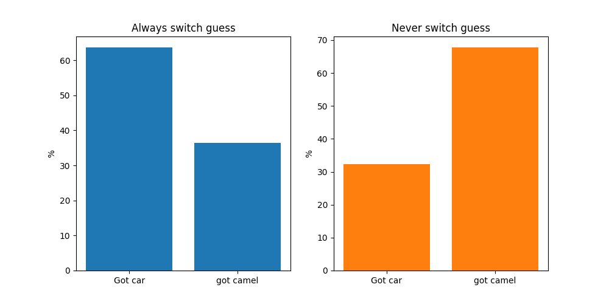

# Monty hall problem

This code runs an experimental verification of the [Monty Hall brain teaser](https://en.wikipedia.org/wiki/Monty_Hall_problem), which is rephrased below:

*Suppose you're on a game show, and you're given the choice of three  doors: Behind one door is a car; behind the others, goats. You pick a  door, say No. 1, and the host, who knows what's behind the doors, opens  another door, say No. 3, which has a goat. He then says to you, "Do you  want to pick door No. 2?" Is it to your advantage to switch your choice?*

The intuitive (but incorrect) answer is that it makes no difference whether you switch or not: the odds of getting a car are 50/50.

The actual answer is that you should always switch*; when you switch, you have a 2/3 chance of getting the car, and when you don't you have a 1/3 chance of getting the car.

* assuming you want a car and not a camel.

_Figure 1: results of running experiment 1000 times switching and 1000 times not switching_

## But why!!?

The host is not choosing their guesses randomly, but is being informed by both your initial decision and their existing knowledge of which door has a car behind it. **If you switch, you will <u>always</u> end up getting the opposite of what you first guessed**. Since you are twice as likely to have first guessed a goat, you are twice as likely to end up with a car if you switch; see table below.

| Initial guess | Odds of getting car if you switch | Odds of getting car if you don't switch |
| ------------- | --------------------------------- | --------------------------------------- |
| Car           | 0                                 | 1                                       |
| camel         | 1                                 | 0                                       |
| camel         | 1                                 | 0                                       |

## how to use:

Basically just press run MontyHall.py to reproduce the figure above. The only non standard library is matplotlib for plotting. 

